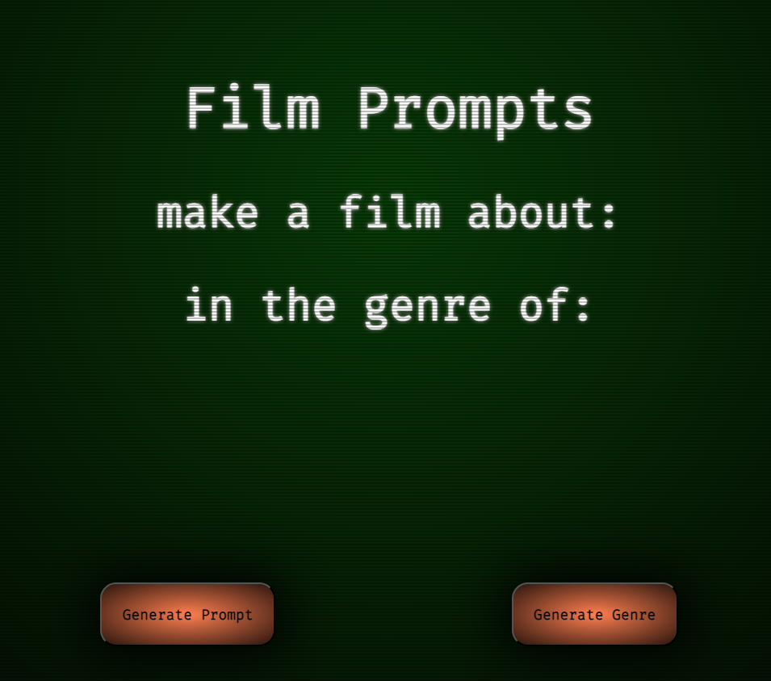
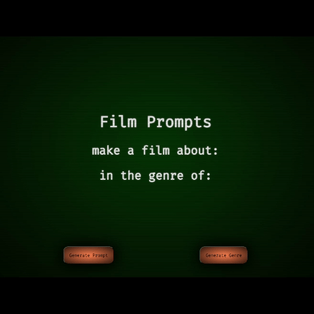
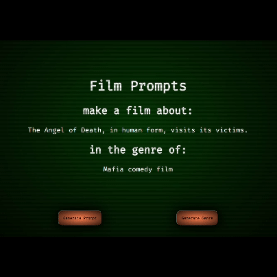

<a name="readme-top"></a>

<!-- PROJECT LOGO -->
<br />
<div align="center">
  <a href="https://github.com/procrastian/react-media-prompts">
    
  </a>
<h3 align="center">Media Prompt Generator using React</h3>
  <p align="center">
    A tool to help film students generate randomised, creative prompts for short film topics.
    <br />
    <a href="https://github.com/procrastian/react-media-prompts"><strong>Explore the docs »</strong></a>
    <br />
    <br />
    <a href="https://procrastian.github.io/Media-Prompts-Generator-using-React/">View Demo</a>
  </p>
</div>

<!-- TABLE OF CONTENTS -->
<details>
  <summary>Table of Contents</summary>
  <ol>
    <li>
      <a href="#about-the-project">About The Project</a>
      <ul>
        <li><a href="#built-with">Built With</a></li>
      </ul>
    </li>
    <li>
      <a href="#getting-started">Getting Started</a>
      <ul>
        <li><a href="#prerequisites">Prerequisites</a></li>
        <li><a href="#installation">Installation</a></li>
      </ul>
    </li>
    <li><a href="#usage">Usage</a></li>
    <li><a href="#roadmap">Roadmap</a></li>
    <li><a href="#contact">Contact</a></li>
  </ol>
</details>

<!-- ABOUT THE PROJECT -->

## About The Project

<a href="https://procrastian.github.io/react-media-prompts/">
  
</a>

This project was bootstrapped with [Create React App](https://github.com/facebook/create-react-app).

<p align="right">(<a href="#readme-top">back to top</a>)</p>

### Built With

- [![React][React.js]][React-url]
- [![JavaScript][JavaScript.js]][JavaScript-url]
- [![Nodejs][Nodejs.js]][Nodejs-url]
- [![HTML5][HTML5.js]][HTML5-url]
- [![CSS3][CSS3.js]][CSS3-url]

<p align="right">(<a href="#readme-top">back to top</a>)</p>

<!-- GETTING STARTED -->

## Getting Started

To get a local copy up and running follow these steps.

### Prerequisites

- npm

  ```sh
  npm install
  ```

### Installation

1. Clone the repo

   ```sh
   git clone https://github.com/procrastian/react-media-prompts.git
   ```

2. Install NPM packages

   ```sh
   npm ci
   ```

<p align="right">(<a href="#readme-top">back to top</a>)</p>

<!-- USAGE EXAMPLES -->

## Usage

In the project directory, you can run:

`npm start`

This runs the app in the development mode.
Open [http://localhost:3000](http://localhost:3000) to view it in your browser.
The page will reload when you make changes.
You may also see any lint errors in the console.

To generate the results, each of the buttons are used.



The prompts can be re-generated, while maintaining the current option of the other catagory.



<p align="right">(<a href="#readme-top">back to top</a>)</p>

<!-- ROADMAP -->

## Roadmap

- [x] Generate a random plot or theme prompt
- [x] Generate a random genre
- [ ] Animate text as it is renders

See the [open issues](https://github.com/procrastian/react-media-prompts/issues) for a full list of proposed features (and known issues).

<p align="right">(<a href="#readme-top">back to top</a>)</p>

<!-- CONTACT -->

## Contact

[![LinkedIn][linkedin-shield]][linkedin-url]

Ian Grantham - dev.iangrantham@gmail.com

Project Link: [https://github.com/procrastian/react-media-prompts](https://github.com/procrastian/react-media-prompts)

<p align="right">(<a href="#readme-top">back to top</a>)</p>

<!-- MARKDOWN LINKS & IMAGES -->

[linkedin-shield]: https://img.shields.io/badge/-LinkedIn-black.svg?style=for-the-badge&logo=linkedin&colorB=0A66C2
[linkedin-url]: https://linkedin.com/in/dev-ian-grantham
[React.js]: https://img.shields.io/badge/React-20232A?style=for-the-badge&logo=react&logoColor=61DAFB
[React-url]: https://reactjs.org/
[JavaScript.js]: https://img.shields.io/badge/JavaScript-20232A?style=for-the-badge&logo=javascript
[JavaScript-url]: https://www.javascript.com/
[HTML5.js]: https://img.shields.io/badge/HTML5-20232A?style=for-the-badge&logo=html5&logoColor=E34F26
[HTML5-url]: https://html.com/
[CSS3.js]: https://img.shields.io/badge/CSS3-20232A?style=for-the-badge&logo=css3&logoColor=1572B6
[CSS3-url]: https://developer.mozilla.org/en-US/docs/Web/CSS
[Nodejs.js]: https://img.shields.io/badge/node.js-20232A?style=for-the-badge&logo=nodedotjs&logoColor=339933
[Nodejs-url]: https://nodejs.org/en
